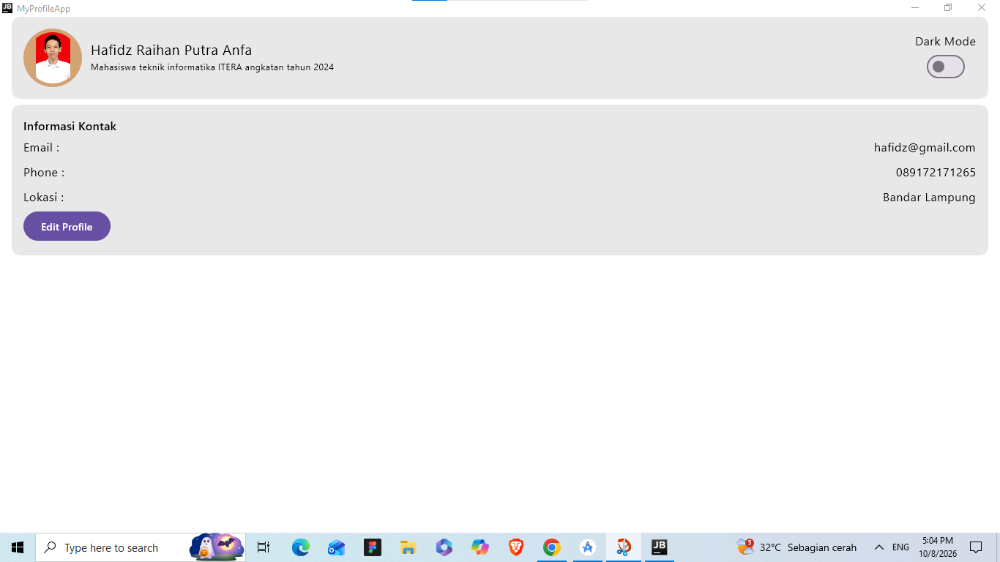
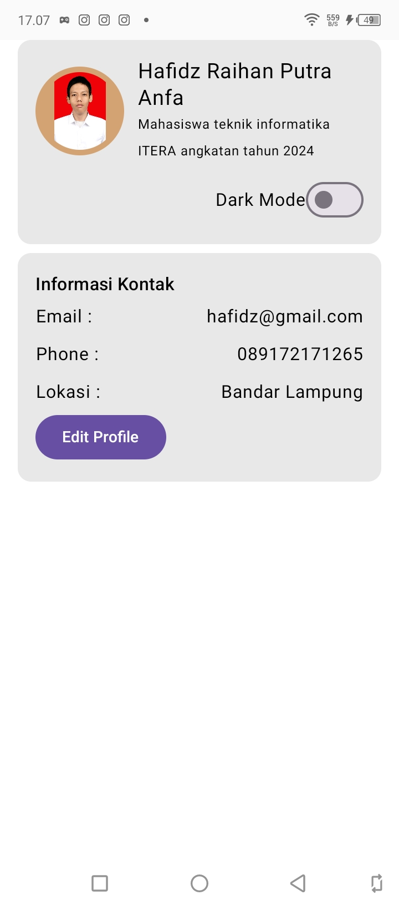
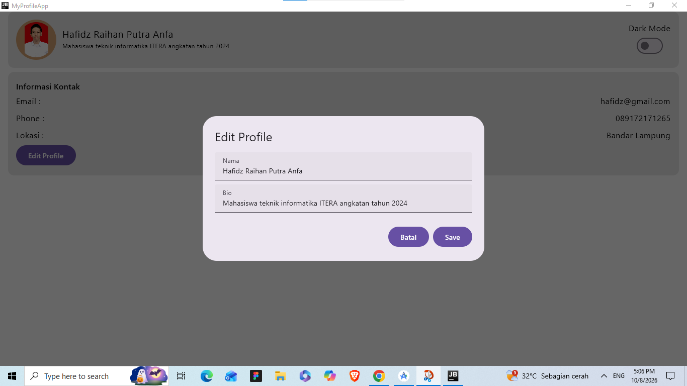
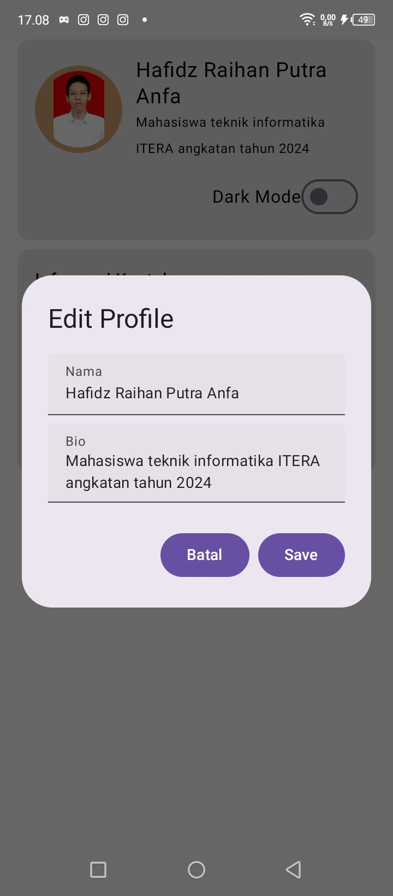
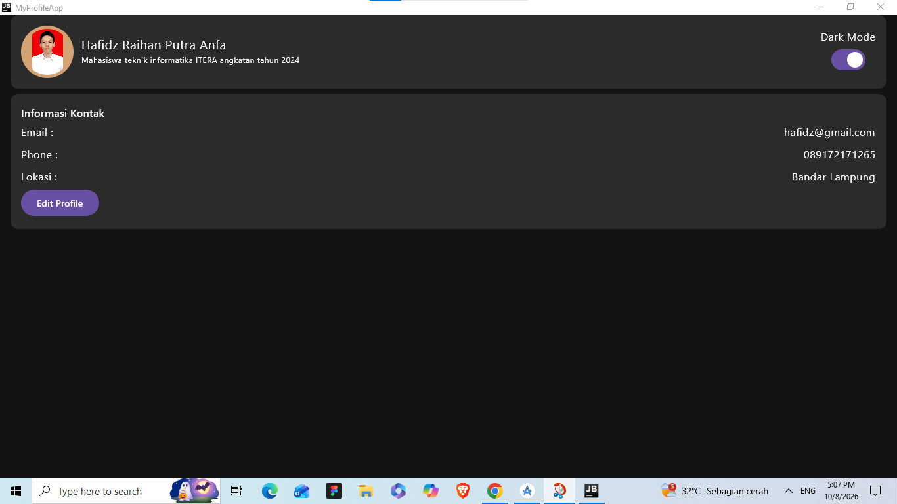
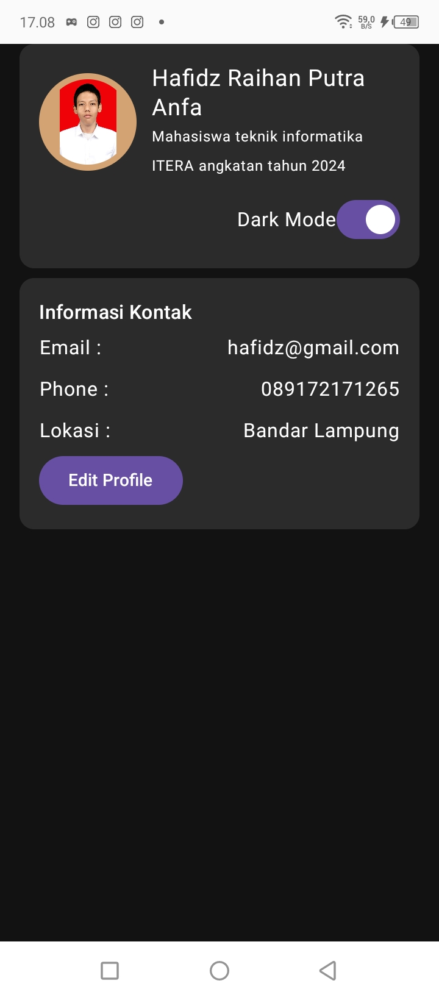

# My Profile App - Minggu 4

Aplikasi Profile menggunakan **Compose Multiplatform** dengan penerapan **State Management dan MVVM**.

## Struktur Folder

```text
shared/src/commonMain/kotlin/com/example/myprofileapp/
│
├── App.kt
│
├── data/
│   └── ProfileUiState.kt
│
├── ui/
│   └── ProfileScreen.kt
│
└── viewmodel/
    └── ProfileViewModel.kt
```

## Screenshot

### Profile View

#### Desktop



#### Mobile



### Edit Profile

#### Desktop



#### Mobile



### Dark Mode

#### Desktop



#### Mobile


